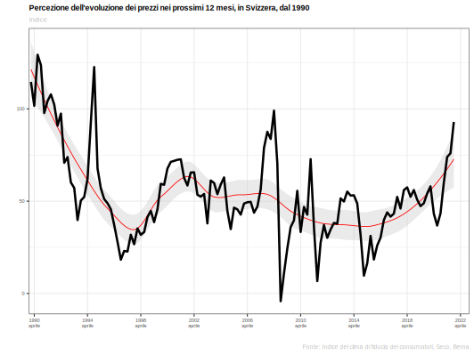
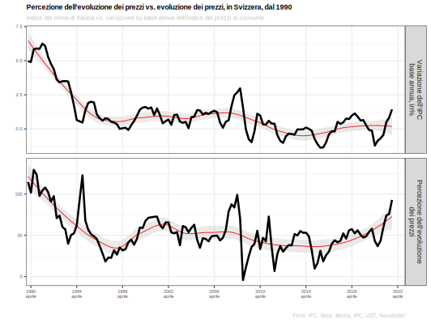
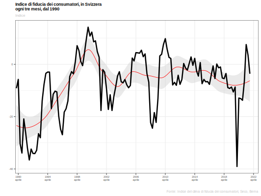
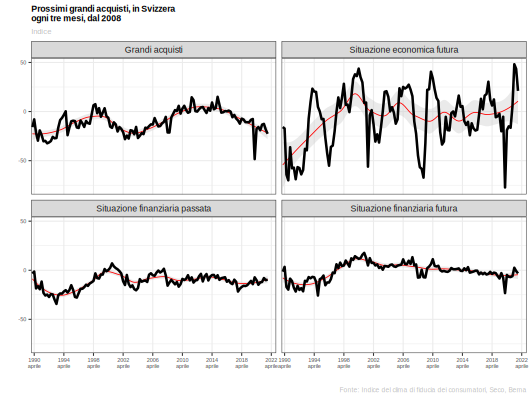
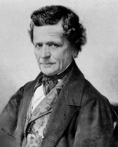
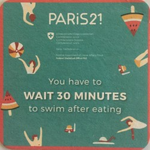
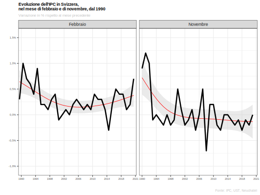

---
output:
  xaringan::moon_reader:
    css: [default, "metropolis_ustat.css", "metropolis-fonts", "specifici.css"]
    lib_dir: immagini
    nature:
      highlightStyle: github
      highlightLines: true
      countIncrementalSlides: false
      ratio: 16:9
    seal: false
    includes:
      after_body: insert-logo.html
---


```{r setup, include=FALSE}
rm(list=ls())

options(htmltools.dir.version = FALSE)

knitr::opts_chunk$set(fig.width=4.25, fig.height=3.5, fig.retina=3,
                      message=FALSE, warning=FALSE, cache = TRUE, 
                      autodep = TRUE, hiline=TRUE
                      , dev = "svg"
                      )

options(knitr.kable.NA = '')
source(file = "Figure.R", encoding = "UTF-8")

```

class: title-slide clear


# **Non solo numeri**
## *Statistica pubblica e giornalismo*

<br>

### .gray[.]
### Eric Stephani (Ufficio di statistica, settore economia)
### .font80[Corso di giornalismo della svizzera italiana]
### .font80[**Modulo 9: Come si leggono le statistiche  e il registro di commercio**]

### .gray50[.font80[*Breganzona, venerdì 25 marzo 2022*]]

---
class: clear, middle

.font110[
*"Non mi fido molto delle statistiche, perché statisticamente un uomo con la testa nel forno acceso e i piedi nel congelatore ha una temperatura media"*
]

.dark-warm-grey[
.font80[
Charles Bukowski
]
]

---
class: hide-logo, inverse, center, middle

# Non solo numeri

---
class: clear, middle

<br>
### ***Vademecum***

1. Il *soggettivo*, il mondo delle percezioni e delle opinioni  

--
2. L'*oggettivo*, il mondo dei dati e dei metadati    

--
3. La *statistica pubblica e il giornalismo*, con quale ruolo?  


---
# Dal soggettivo all'oggettivo


.hl[**Punto di partenza**]  
*La realtà percepita, l'opinione individuale*

--

> "Riferendovi alle vostre percezioni o esperienze, quale sarà l’evoluzione dei prezzi nei prossimi 12 mesi in Svizzera?"


<br>
*Risposte:*  

.pull-left[
.font80[
- Forte diminuzione **(-2)**  
- Leggera diminuzione **(-1)**  
- Quasi nessuna variazione **(0)**

]
]

.pull-right[
.font80[
- Forte aumento **(+2)**  
- Leggero aumento **(+1)**  
- Non so **(0)**

]
]

---
class: clear

.font70[
.left-column[
#### La .hl[percezione] dell'evoluzione dei prezzi

]
]

--

.right-column[


]

---
class: clear

.font70[
.left-column[
#### La *percezione* dell'evoluzione dei prezzi
#### L'evoluzione .hl[effettiva] dei prezzi

]
]


.right-column[

]

---

class: hide-logo, inverse, center, middle

# Clima di fiducia dei consumatori


---
# Dall'oggettivo al soggetivo


.font70[
.left-column[
#### .hl[Punto di partenza]
Il comunicato stampa della Seco

]
]


.right-column[
.font50[
01 febbraio 2022,
  [www.**seco**.admin.ch](https://www.seco.admin.ch/seco/it/home/seco/nsb-news.msg-id-86993.html) : ***"L’aumento dei prezzi si ripercuote sulla fiducia dei consumatori"***
  
]

.font60[
> "Secondo il sondaggio di gennaio, la fiducia dei consumatori si è leggermente indebolita: da un lato le prospettive generali dell’economia sono valutate in modo meno positive e dall’altra l’aumento dei prezzi pesa sempre di più sulla propensione all’acquisto."

]
]

--

.right-column[
.font50[
01 febbraio 2022,
  [Keystone - ATS (ripreso da swissinfo.ch)](https://www.swissinfo.ch/ita/tutte-le-notizie-in-breve/fiducia-dei-consumatori-svizzeri-scende-sensibilmente/47309954) : ***"Fiducia dei consumatori svizzeri scende sensibilmente"***
]

.font60[
> "Gli svizzeri guardano con meno favore al futuro: la fiducia dei consumatori è tornata a scendere e l'aumento dei prezzi pesa sempre di più sulla propensione agli acquisti.  
[...] La situazione finanziaria non viene però ritenuta rosea, cosa che secondo i funzionari bernesi è probabilmente dovuta all'aumento dei prezzi al consumo, che riduce il potere d'acquisto delle famiglie. Il rincaro rende la gente meno propensa a spendere per acquisti importanti: il relativo indice è ancora notevolmente al di sotto sia del livello pre-crisi, sia della media a lungo termine."

]
]


---
class: clear

.font70[
.left-column[
Come sta evolvendo l'indice di .hl[fiducia] dei consumatori?
<br>
Cosa s'intende con .hl[situazione finanziaria meno rosea]?
<br>
... e con la gente è .hl[meno propensa a fare acquisti]?

]
]

.img-left[]

--

<br>
.right-column[
Le domande sono corrette?

]

--

.right-column[
.pull-left[
SI
]

.pull-right[
.hl[NO]
]
]

--

.right-column[
Le domande non sono scorrette, ma ce n'è una .hl[più] urgente

]

---
class: clear

.font70[
.left-column[
#### .hl[Come si misura] l'indice di fiducia dei consumatori?

<br>
.img-left[]

]
]

--

.right-column[
<br>
#### **I metadati**

.font70[
> *“I *metadati*, o *data about data* sono tutte le informazioni che permettono ai numeri di parlare di farci comprendere appieno il loro significato: glossari, classificazioni, **definizioni**, **metodologia**,...”*

]
]

--

.right-column[

#### Esempio

.font80[
.hl[**SECO**], Situazione economica e politica economica >>  
Clima di fiducia dei consumatori >> [Metodologia.pdf](https://www.seco.admin.ch/seco/it/home/wirtschaftslage---wirtschaftspolitik/Wirtschaftslage/Konsumentenstimmung.html)

]
]


---

class: clear

.font70[
.left-column[
#### Il clima di fiducia dei consumatori

]
]

.right-column[


]

---

class: clear

.font70[
.left-column[
#### Il clima di fiducia
#### Sottoindici

]
]

.right-column[


]


---

class: hide-logo, inverse, center, middle

# Il ruolo della statistica pubblica

---

# Il ruolo della statistica nel tempo

.pull-left[
###### 1850


.font70[
*"La statistica non si deve limitare a dati e fatti oggettivi, ma deve sforzarsi di mettere il cittadino in condizione di formarsi un proprio giudizio"*
]
]

--

.pull-right[
###### 2018
[
](https://tp.srgssr.ch/p/portal?urn=urn:srf:ais:video:fcca4df0-83e3-4982-aaf5-62a9b9c347c5&autoplay=true&legacy=true&width=640&height=360&playerType=)

.font70[
*Vertrauen in öffentliche Daten immer wichtiger*
].font50[.mid-warm-grey[ SRF, Tagesschau - 04 aprile 2018 (14:47)
]]
]

---

# Il ruolo della statistica .hl[oggi]

.pull-left[

##### Problema: "Come ~~facilitare~~ migliorare l'uso dei dati ?"


.font50[
.dark-warm-grey[
*“Polarised opinion landscapes and widespread misinformation have formed in an environment where emotions and beliefs prevail over facts and evidence. Something needs to be done to **regulate** the new data ecosystem, **educate** citizens and **limit** the misuse of data information”*
]
Paris21, conferenza annuale, Berna, 04.04.2018 - [[link]](https://paris21.org/about-paris21)

]
]

--

.pull-right[

##### La regola delle 3C*

.font80[
1. **.hl[**C**]ontrollare** .font80[.mid-warm-grey[*[Check your pre-conceived ideas]*]]  
La statistica conferma o smentisce la mia opinione?

2. **.hl[**C**]apire** il contesto .font80[.mid-warm-grey[*[Understand the context]*]]  
Perché si usa una certa statistica in un determinato contesto? La statistica è sufficiente per descriverlo o manca qualcosa?

3. Essere **.hl[**c**]onsapevoli** .font80[.mid-warm-grey[*[Be aware of the source]*]]  
Conosco la fonte del dato, da dove arriva? Più conosco una fonte e più so se posso fidarmi o meno.

[*3 ways to avoid data traps](https://paris21.org/3-ways-avoid-data-traps?msclkid=043ad96faabc11ecbe71666b07d0edf3)
]
]


---

class: middle clear

### Come cambiare e perché ha senso cambiare

.mid-warm-grey[
.font80[
Punto di partenza

]
]

--

.pull-left[
##### La cultura del pretendere
.img.left[]
.font70[
.hl[Voglio] dei dati che:
- confermino la mia tesi  
- possano essere almeno messi in contrapposizione

]
]

--

.pull-right[
##### .hl[vs.] la cultura dello scoprire
.img-left[]

.font70[
Applicare la *Regola delle 3C*:  
- *.hl[C]ontrollare*  
- *.hl[C]apire*  
- Essere *.hl[c]onsapevoli*

]
]

---

class: hide-logo, inverse, center, middle

# L'indice dei prezzi al consumo

---

# .hl[Punto di partenza]: i metadati

.font70[
.left-column[
#### L'indice dei prezzi al consumo

]
]


.right-column[
.font80[
*Domande utili*  
- .hl[Perché] si misura l'indice? E, da quando?

]]

--

.right-column[
.font80[
Per costruire un indice devo definire un paniere di beni, ma allora devo decidere:  
- .hl[Quali] beni includere? Quali beni e quali prezzi occorre monitorare? Come si monitorano i prezzi?    
- Come faccio a determinare un .hl[peso] per ogni bene? 

]
]


---

# Dall'oggettivo al soggetivo / 2


.font70[
.left-column[
#### Dai comunicati stampa ai media

]
]


.right-column[
.font50[
01 dicembre 2021,
  [www.**bfs**.admin.ch](https://www.bfs.admin.ch/bfs/it/home/statistiche/prezzi/indice-nazionale-prezzi-consumo.assetdetail.20384681.html) : ***In novembre i prezzi al consumo sono rimasti stabili***
]

.font60[
> "Rispetto al mese precedente, nel novembre 2021 l’indice dei prezzi al consumo (IPC) è rimasto stabile a 101,6 punti (dicembre 2020 = 100) [...]. La stabilità dell'indice rispetto al mese precedente è il risultato di tendenze opposte che si sono compensate a vicenda. I prezzi dei carburanti sono aumentati, come pure quelli degli affitti delle abitazioni e dell’olio da riscaldamento. Hanno invece registrato un calo i prezzi dei pernottamenti in albergo, come pure quelli degli ortaggi."

]
]


.right-column[
.font50[
03 marzo 2022,
  [www.**bfs**.admin.ch](https://www.bfs.admin.ch/bfs/it/home/statistiche/prezzi/indice-nazionale-prezzi-consumo.assetdetail.21764722.html) : ***In febbraio i prezzi al consumo sono aumentati dello 0,7%***
  
]

.font60[
> "Nel febbraio 2022 l’indice dei prezzi al consumo (IPC) è aumentato dello 0,7% rispetto al mese precedente, attestandosi a 102,4 punti (dicembre 2020 = 100). Rispetto allo stesso mese dell’anno precedente, il rincaro è stato del +2,2%. È quanto emerge dai risultati dell’Ufficio federale di statistica (UST). 
La crescita dello 0,7% rispetto al mese precedente è riconducibile a vari fattori, tra cui l'aumento dei prezzi dei carburanti."

]
]


--

.right-column[
.font50[
01 dicembre 2022,
  [www.**rsi**.ch](https://www.rsi.ch/news/svizzera/Non-fa-rumore-ma-sale-14908479.html) : ***Non fa rumore ma sale***
  
]

.font60[
> "Inflazione in Svizzera all'1,5%: ai massimi da 13 anni, nel solco di una tendenza generale, anche se in modo ben meno marcato rispetto ad altri Paesi. L'indice dei prezzi al consumo ha fatto segnare in novembre un aumento su base annua dell'1,5%, mentre il dato del mese precedente era dell'1,2%. L'inflazione torna quindi ad aumentare anche in Svizzera e con valori che non si registravano dal novembre del 2008."

]
]


---
class: clear

.font70[
.left-column[
#### L'indice dei prezzi al consumo
#### Valutazione recente

]
]


.right-column[


]

---
class: clear

.font70[
.left-column[
#### L'indice dei prezzi al consumo
#### Valutazione recente
#### Prossimi appuntamenti

]
]


.right-column[
.font80[
Indice dei prezzi al consumo, del mese di marzo: 1° aprile 2022 >> .gray[
[(*Agenda* Ustat)](https://www.ti.ch/ustat)
]
Indice del clima di fiducia, del mese di aprile: 2 maggio 2022 >> .gray[
[(*Agenda* Seco)](https://www.seco.admin.ch/seco/fr/home/wirtschaftslage---wirtschaftspolitik/Wirtschaftslage/Konsumentenstimmung.html)
]
]
]

--

.right-column[
.font80[
#### Temi correlati
- prezzi delle costruzioni, prezzi immobiliari, prezzi delle casse malati,...
- salari, rendite,...
- PIL
- ...

]
]


---
# Cosa vedevamo

.left-column[
###### Passato
<br>
.img-left[]

]

--

.right-column[

###### La statistica dei... luoghi comuni
.font80[
*"Seconno le statistiche d’adesso risurta che te tocca un pollo all’anno: e, se nun entra nelle spese tue, t’entra ne la statistica lo stesso perché c’è un antro che ne magna due."*
.dark-warm-grey[
Trilussa
]

*"Se vuoi ispirare fiducia, dai molti dati statistici. Non importa che siano comprensibili, basta che siano in quantità sufficiente"*
.dark-warm-grey[
Lewis Carroll
]

<br>
Altri esempi:  
-> [*''raccolta'' Istat*](https://www.istat.it/it/archivio/16514)

]
]

---
# Cosa vedremo

.left-column[
###### Futuro
<br>
.img-left[]
]

--

.right-column[
###### La regola delle 3C
###### .mid-warm-grey[CUBe's formula: `*Check x understand x be aware*`]
.font80[
1. .hl[**C**ontrollare], .mid-warm-grey[*[**C**heck]*]  
posso confrontare la statistica alla mia opinione?  
.white[-]  
2. .hl[**C**apire il senso], .mid-warm-grey[*[**U**nderstand  the context]*]  
l'uso dei dati ha senso rispetto al contesto?  
.white[-]  
3. Essere .hl[**c**onsapevoli], .mid-warm-grey[*[**Be** aware of the source]*]  
conosciamo la fonte statistica? ci possiamo fidare, perchè?

]
]

---
# Conclusione

.left-column[
###### Oltre il *make-up*

]


.right-column[

  

.font80[
**Im Dschungel verloren**  
*"Bisweilen scheint es, die Statistiker verlören sich in den Medien, die Medien verlören sich in den Statistiken und es gehen im Dschungel der Zahlen nicht nur alle, sondern alles verloren. Das muss nicht sein."*
]
.font60[.mid-warm-grey[*Beat Glogger*, autore e giornalista scientifico. Journées suisses de la statistique 2014, Yverdon les bains]]


.font40[
<br>
<br>
<br>
<br>
<br>
.mid-warm-grey[
Slides create con R via: [{r-project}](https://www.r-project.org) e [{xaringan}](https://github.com/yihui/xaringan)

]
]
]

---

class: title-slide-fin clear hide-logo


# Contatti

.font70[
.pull-right2[
.white[ ]  
Eric Stephani  
[eric.stephani@ti.ch](mailto:eric.stephani@ti.ch)  

.white[ ]  
Repubblica e Canton Ticino  
Divisione delle risorse  
**Ufficio di statistica**  
[www.ti.ch/ustat](http://www.ti.ch/ustat)

]
]

